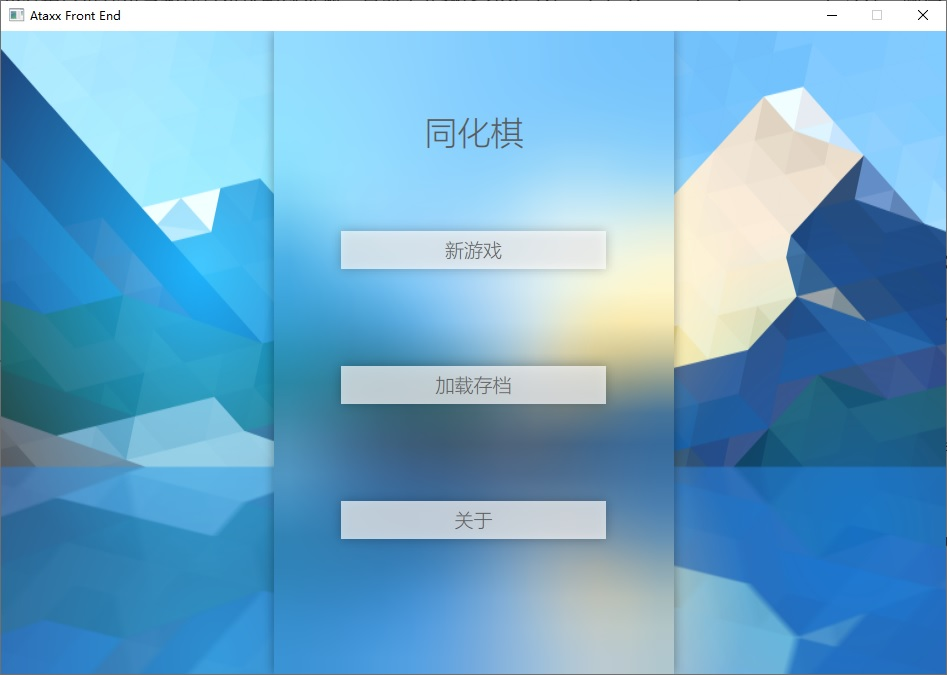
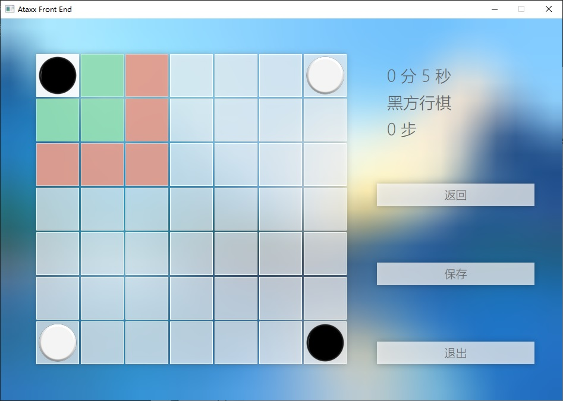

# 同化棋

## 简介

北京大学 2021 年计算概论 A 大作业。

本 repo 是前端部分。

这是 2022 年重构的前端版本，仅保留双人对战功能。采用 QML 与 C++ 编写。

## 编译指南

对于 Windows 系统，要求安装 Qt 5.15.2 SDK，MSVC v143（VS 2022）。同时，你还需要安装 [xmake](https://xmake.io/#/zh-cn/) 作为构建系统。

对于其他操作系统未经测试。但本项目只使用了 Qt 开源版和 C++ 标准库，因此理论上是跨平台的。你需要使用支持 C++ 20 标准的编译器编译。

本项目的默认 GUI 字体为 Microsoft YaHei UI Light。对于其他操作系统，你需要自行更改字体。

## 截图

